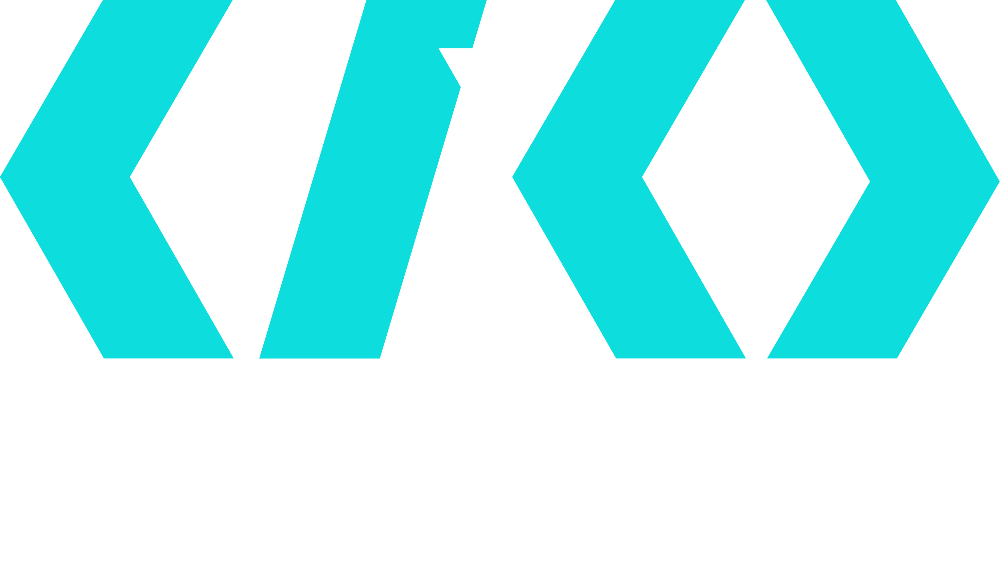

# CI/CD Best Practices (cicdbestpractices.com)

An open source website to house information on the techniques, patterns and implementation of CI/CD knowledge in the wild.

## Contributing

To add/change or suggest something, please check out the [Contributing](CONTRIBUTING.md) guide.

<!-- readme: contributors -start -->
<table>
<tr>
    <td align="center">
        <a href="https://github.com/TheJokersThief">
            
             
            <b>Evan Smith</b>
        </a>
    </td></tr>
</table>
<!-- readme: contributors -end -->

## License

Licensed under the [GNU GPL](LICENSE) license.
