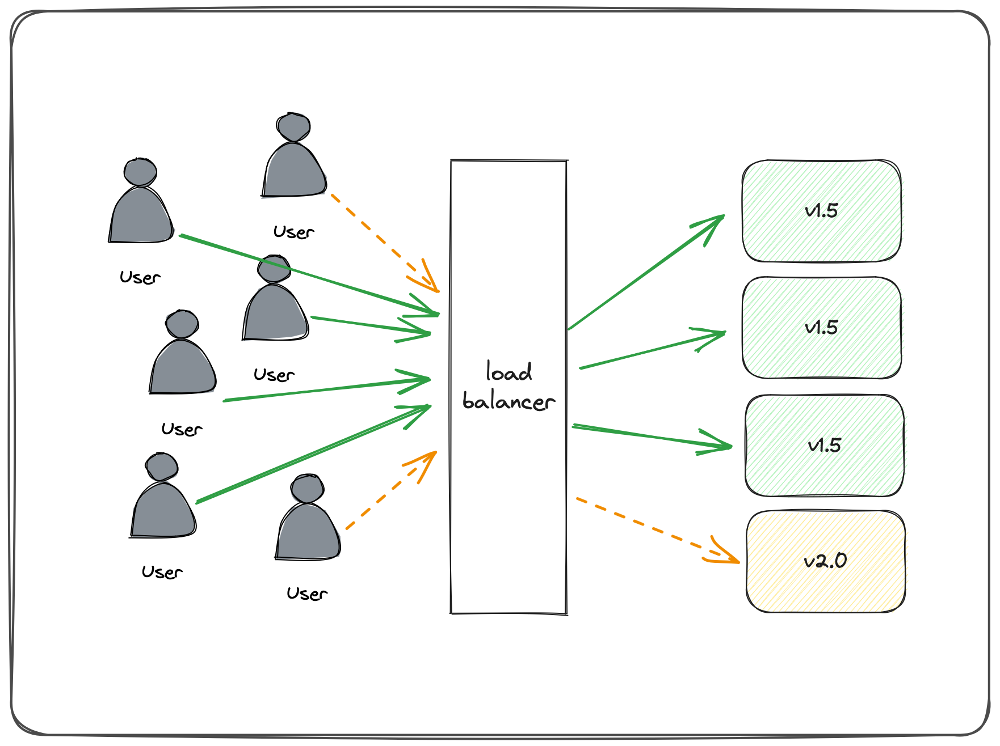
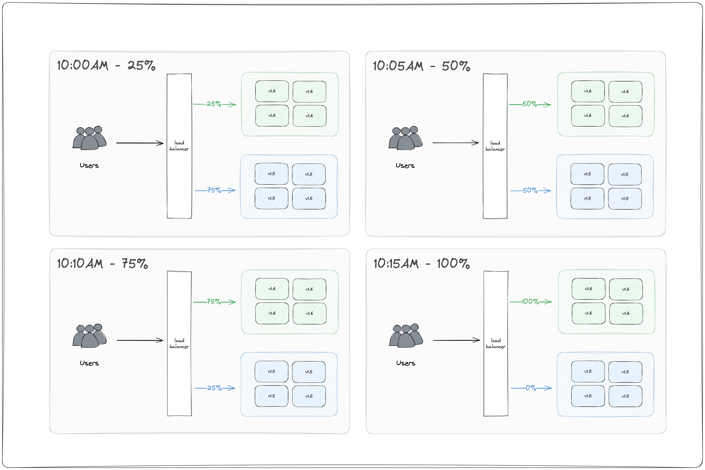

## Popular patterns

### Canary deploys

Canary deploys are named after the method of using [Canaries to detect
danagerous gasses in coal mines](https://en.wikipedia.org/wiki/Sentinel_species).
In technology, a canary is when we deploy a new version of our software to a 
subset of our environment/customers to trial it before making it more largely
available to everyone.

#### Benefits
* **A/B testing:** we can use the canary to do A/B testing. In other words, 
we present two alternatives to the users and see which gets better reception.
* **Capacity test:** it’s impossible to test the capacity of a large 
production environment. With canary deployments, capacity tests are built-in. 
Any performance issues we have in our system will begin to crop up as we 
slowly migrate the users to the canary.
* **Feedback:** we get invaluable input from real users.
* **No cold-starts:** new systems can take a while to start up. Canary 
deployments slowly build up momentum to prevent cold-start slowness.
* **No downtime:** like blue-green deployments, a canary deployment doesn’t 
generate downtime.
* **Easy rollback:** if something goes wrong, we can easily roll back to the 
previous version.

### Blue-green deploys

Blue-green deploys are where we run two identical versions of our environment:

1. One for the current version (Blue)
1. One for the newer version (Green)

We split the traffic between these two versions, and then over time route more
and more traffic to the Green version until it becomes the new Blue version. 

Instead of traffic splitting, some folks do this by customer, slowly migrating
more and more customers to the new version.

#### Benefits

* **Deploy at any time:** no downtime means that we can make releases at any 
time. There is no need to wait for maintenance windows.
* **Instant rollback:** the cut-over works both ways. If we decide to go back 
to the previous version, we can switch all users back in an instant.
* **Hot standby:** blue-green can save us from disaster scenarios. Suppose that 
one data center goes offline, bringing the live environment down. No biggie, 
we’ll switch to the other until the problem is fixed. This will work as long we 
have had the precaution of not putting blue and green on the same availability zone.
* **Postmortem:** debugging failed releases is hard with in-place deployments. 
When faced with downtime, the priority is always to return to normality. 
Collecting debugging data is secondary, so a lot of valuable information may be 
lost during the rollback. Blue-green doesn’t suffer from this problem – rollbacks 
always leave the failed deployment intact for analysis.
