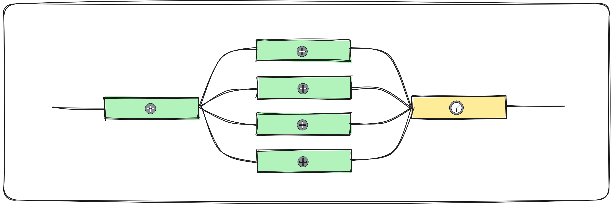

The easiest way to speed up CI builds is to split your tasks up to be run in 
parallel on multiple machines. Parallelising your workload means that you
are only limited by the slowest step in your build. Think about things that don’t 
immediately look like they could be run independently verify that assumption –
Knowing your dependency graph inside-out is going to help a lot.

## What is "sharding"?

In distributed computing, we talk about splitting up a process across multiple
machines. To do this, we separate a workload into "shards" of deterministic
tests/actions. In CI, it often means batching all of our unit tests into
X number of shards, which will then be run concurrently.

## Popular patterns

### Fan-out/Fan-in

This pattern involves running a common build/compilation step to setup the code
for testing, then fanning-out run a set of acceptance tests in parallel and
then fanning-in again to run the deploy job.

import NodeJest from './test_frameworks/node-jest.mdx';
import NodeCypress from './test_frameworks/node-cypress.mdx';
import PythonPytest from './test_frameworks/python-pytest.mdx';

## Test Sharding

### Node - Cypress
<NodeCypress />

### Node - Jest
<NodeJest />

### Python - pytest
<PythonPytest />

import CircleCI from './providers/CircleCI.mdx';
import GithubActions from './providers/GitHubActions.mdx';
import Jenkins from './providers/Jenkins.mdx';
import TravisCI from './providers/TravisCI.mdx';

## How to for CI providers

### CircleCI

<CircleCI />

### Github Actions

<GithubActions />

### Jenkins

<Jenkins />

### Travis CI

<TravisCI />
